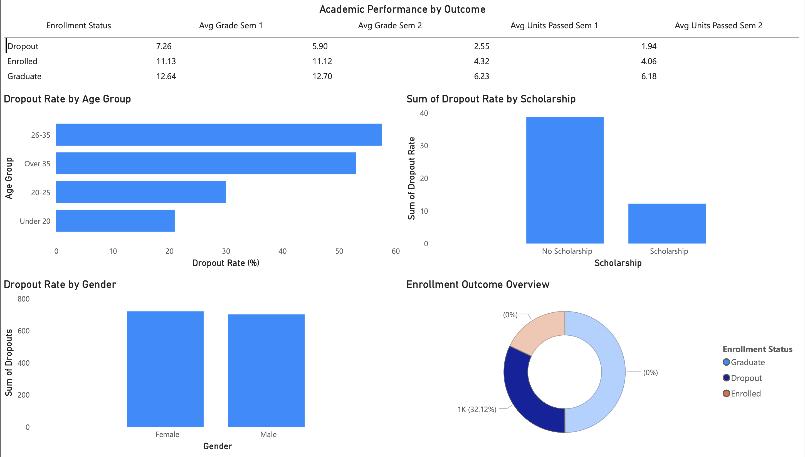

# Enrollment Intelligence

End-to-end data engineering and ML project predicting student dropout risk.

## Architecture
Raw CSV - ETL Pipeline - PostgreSQL Star Schema - ML Model - FastAPI - Power BI Dashboard

## Tech Stack
- Python, Pandas, SQLAlchemy
- PostgreSQL
- scikit-learn (Random Forest, 90% accuracy)
- FastAPI
- Power BI

## Key Insights
- 32% dropout rate across 4,424 students
- Students aged 26-35 have highest dropout risk (57%)
- Scholarship holders are 3x less likely to drop out
- Semester 1 grades are the strongest dropout predictor

## PowerBI Dashboard

## API
[View API Docs](YOUR_RENDER_LINK_HERE/docs)

## Project Structure
├── pipeline/        # ETL scripts
├── database/        # Star schema SQL
├── models/          # ML training
├── api/             # FastAPI
├── dashboard/       # Power BI exports
└── data/            # Raw and cleaned data
